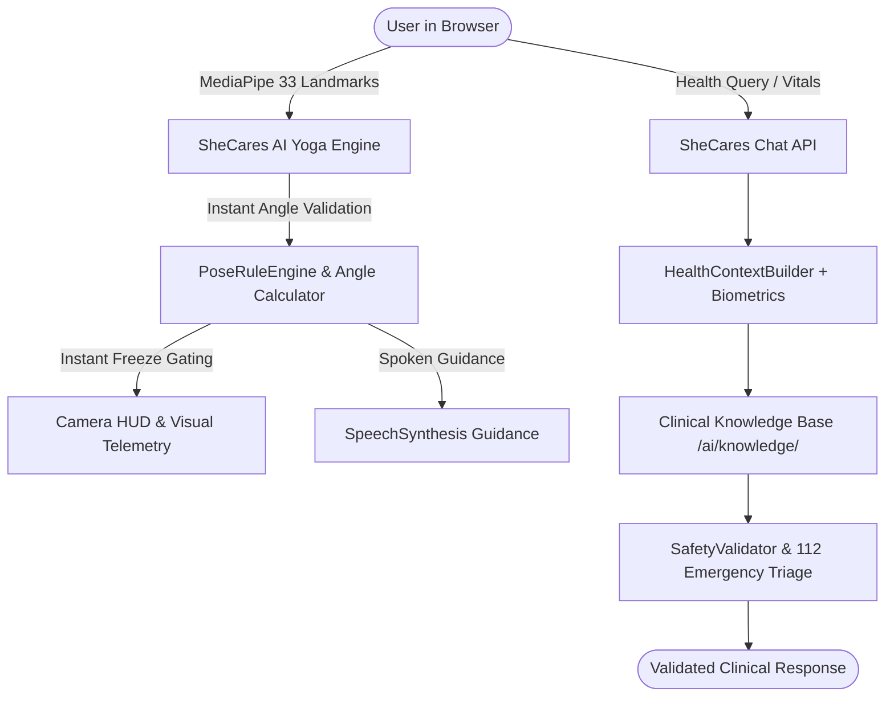

# SheCares Custom AI System Architecture

## 1. Overview
The SheCares application integrates two custom, privacy-preserving, zero-external-vendor AI subsystems:
1. **SheCares AI Yoga Pose & Biomechanical Alignment Studio**
2. **SheCares Clinical Health & Triaging AI Engine**

Both subsystems run without dependencies on commercial black-box APIs like AsanaAI or Infermedica.

## 2. AI Yoga Pose Engine
- **Inference Mode**: Direct client-side inference using `@mediapipe/pose` Lite WASM model at 30–60 FPS.
- **Biomechanical Evaluation**: Computes 3D joint angles for elbows, shoulders, hips, knees, and ankles.
- **Pose Library**: 41 clinically vetted yoga poses in `js/yoga/YogaPoseLibrary.js` and expanded master registry of 196 poses in `ai/datasets/processed/master_yoga_pose_registry.json`.
- **Gating System**: Timer and hold counters freeze immediately upon posture fault, highlighting faulty joints with pulsing red target rings on the canvas overlay.

## 3. SheCares Clinical Health AI Engine
- **Deterministic Clinical Grounding**: Follows guidelines from ACOG, AHA/ACC, ADA, RSSDI, ICMR, and WHO.
- **Curated Knowledge Base**: Multi-domain modules located in `ai/knowledge/` covering menstrual health, pregnancy, diabetes, nutrition, fitness, mental health, and emergency red flags.
- **Emergency Escalation**: Immediate detection of cardiac distress, stroke, obstetric hemorrhage, or severe hypertensive crises escalates directly to **112 (India National Emergency)** and triggers SheCares's SOS workflow.
- **Zero Hallucination Protocol**: If requested biometrics are not synchronized, the assistant transparently responds with data-not-available notices rather than fabricating metrics.
