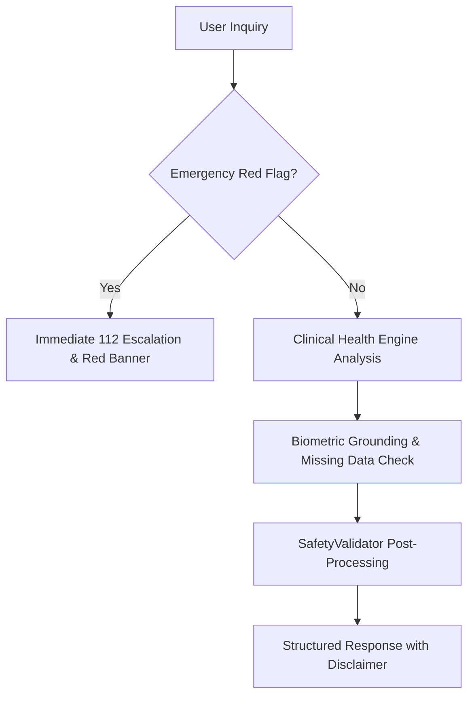

# SheCares Safety & Emergency Triage Protocol

## 1. Safety Architecture
The safety architecture guarantees that user health inquiries undergo safety filtering and clinical validation before being presented to the patient.

## 2. Emergency Triggers & Protocol

| Trigger | Clinical Concern | Action | Escalation |
| :--- | :--- | :--- | :--- |
| **Severe Chest Pain / Pressure** | Acute Coronary Syndrome / MI | Advise semi-upright posture; chew aspirin if non-allergic | **Call 112 Immediately** |
| **Stroke FAST Signs** | Acute Ischemic / Hemorrhagic Stroke | Note onset time; urgent ER transfer | **Call 112 Immediately** |
| **Severe Obstetric Bleeding** | Placental Abruption / Hemorrhage | Elevate pelvis; urgent maternity hospital transfer | **Call 112 Immediately** |
| **Hypertensive Crisis (>180/120)** | End-organ damage risk | Immediate emergency room evaluation | **Call 112 Immediately** |
| **Severe Hypoglycemia (<50 mg/dL)** | Neuroglycopenia / Seizure | Rule of 15 (fast-acting glucose) or emergency glucagon | **Call 112 Immediately** |

## 3. Disclaimers & Regulatory Notice
All SheCares AI outputs conclude with the verified disclaimer:
> *Health information only — not a substitute for professional medical advice. For emergencies, contact 112.*
